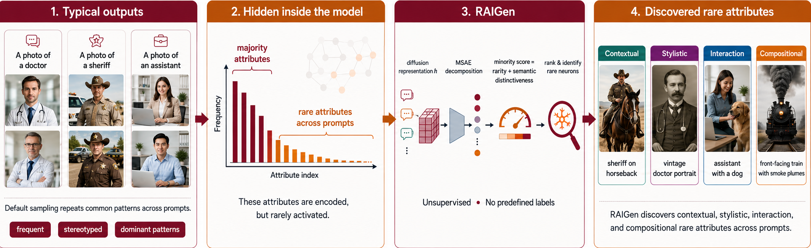

# RAIGen: Rare Attribute Identification in Text-to-Image Generative Models

<p align="center">
  
</p>

<p align="center">
  <a href="https://arxiv.org/abs/2602.06806">Paper</a> &nbsp;|&nbsp;
  <a href="https://vssilpa.github.io/RAIGen_webpage/">Project Page</a>
</p>

---

## Overview

RAIGen discovers rare visual attributes that text-to-image diffusion models systematically under-generate through the following steps:

1. Extracting mid-block UNet activations over generated images
2. Training a **Matryoshka Sparse Autoencoder (MSAE)** on those activations to decompose them into interpretable features
3. Identifying **minority neurons** — features that activate rarely and represent semantically distinct, under-represented attributes
4. Using a VLM (**gpt-5.2**) to annotate each minority neuron with a human-readable attribute description

---

## Rare Attribute Identification

### Environment Setup

```bash
conda create -n raigen_gen python=3.10 -y
conda activate raigen_gen
pip install torch==2.5.1 torchvision==0.20.1 --index-url https://download.pytorch.org/whl/cu124
pip install -r requirements_gen.txt
```

You also need an OpenAI API key for the annotation step:

```bash
export OPENAI_API_KEY="your_openai_api_key"
```

### Running RAIGen (`scripts/run_raigen.sh`)

This stage collects activations, trains a Matryoshka SAE, and annotates minority neurons using gpt-5.2.

Set the task and prompt at the top of the script:

```bash
# In scripts/run_raigen.sh:
task="prof"       # "prof" for professions, "coco" for COCO captions
prof="Doctor"     # profession name (prof) or COCO caption text (coco)
```

Then run:

```bash
bash scripts/run_raigen.sh
```

This executes three steps:

1. **Activation collection** — generates 5 000 images with SDXL and extracts UNet mid-block activations using `accelerate` 
2. **MSAE training** — trains a Matryoshka Sparse Autoencoder on the activations via `msae/train_msae.py`
3. **Annotation** — uses gpt-5.2 to identify and describe minority neuron attributes via `annotate.py`

Outputs are saved to `checkpoints_sdxl/<task>/<prompt>/`.

**Prompt lists** are in `resources/professions_10.txt` (10 professions) and `resources/coco_50.txt` (50 COCO captions).

### Visualising minority neurons (`minority_neuron_inference.ipynb`)

We recommend using our pre-trained MSAE checkpoints with the inference notebook to explore minority neurons directly — no training needed.

Pre-trained checkpoints and pre-computed annotations for **10 professions** and **50 COCO captions** are available on Google Drive: [RAIGen Checkpoints & Annotations](https://drive.google.com/drive/folders/146SmEEbRrX9WpcK31oP3dQDfM2XcWxZ2?usp=drive_link)

To run the notebook, you need:
- The downloaded SAE checkpoint (`sae.pt`)
- Hooked activations and corresponding generated images for your prompt — run only the activation collection step from `scripts/run_raigen.sh` to obtain these.

Edit the variables at the top of the notebook to point to your paths:

```python
PROMPT       = 'Doctor'
SAE_CKPT_DIR = f'raigen_checkpoints/prof/{PROMPT}'
IMAGE_DIR    = f'dataset_sdxl/prof/{PROMPT}/stable-diffusion-xl-base-1.0'
ACT_DIR      = f'activations_sdxl/prof/{PROMPT}/stable-diffusion-xl-base-1.0'
GROUP_SIZES  = [2048, 18432]   # must match the checkpoint's group sizes
```

The notebook outputs a grid showing the top activating images and heatmap overlays for each minority neuron, ranked by minority score.

Pre-computed annotations can also be used directly at evaluation time without running the notebook (see Evaluation below).


## Evaluation

### Environment Setup

```bash
conda create -n raigen_eval python=3.10 -y
conda activate raigen_eval
pip install torch==2.5.1 --index-url https://download.pytorch.org/whl/cu124
pip install -r requirements_eval.txt
```

### Running Evaluation (`scripts/run_eval.sh`)

This stage generates a fresh set of images, evaluates attribute presence using Llama-4-Scout-17B-16E and Qwen3-VL-8B, and computes per-attribute presence rates.

Set the parameters at the top of `run_eval.sh`:

```bash
task="prof"       # "coco" or "prof"
prompt="Doctor"   # profession name or COCO caption
top_n=10          # number of minority neurons to evaluate (5 for coco, 10 for prof)

# Path to minority_dir produced by RAIGen (found under checkpoints_sdxl/<task>/<prompt>/):
minority_dir="sdxl_unet.mid_block_20480_2_[2048, 18432]/final/raigen_neurons/neurons_analysis_group_0_2048"
```

To skip Stage 1 entirely and use pre-computed annotations, change `annotations_path` to:

```bash
annotations_path="$root_dir/raigen_annotations/$task/${prompt}_annotations.json"
```

Then run:

```bash
bash scripts/run_eval.sh
```

This runs:

1. **Image generation** — generates 1 000 images with SDXL via `generate_images.py`
2. **Attribute evaluation** — queries each VLM on each image for each annotated attribute via `evaluate.py`

Results are written to `raigen_eval_outputs/metrics/<task>/`:
- `<prompt>_<model>_attribute_presence.json` — per-image attribute answers
- `<model>_attribute_eval_summary.json` — average attribute presence rates across all prompts

---

## Acknowledgements

This codebase builds upon:

- [matryoshka_sae](https://github.com/bartbussmann/matryoshka_sae) — Matryoshka Sparse Autoencoder implementation
- [SAeUron](https://github.com/cywinski/SAeUron)  — activation collection and hooked diffusion model infrastructure

---

## Citation

```bibtex
@article{sreelatha2026raigen,
  title     = {RAIGen: Rare Attribute Identification in Text-to-Image Generative Models},
  author    = {Vadakkeeveetil Sreelatha, Silpa and Wang, Dan and Belongie, Serge
               and Awais, Muhammad and Dutta, Anjan},
  journal   = {arXiv preprint arXiv:2602.06806},
  year      = {2026}
}
```
